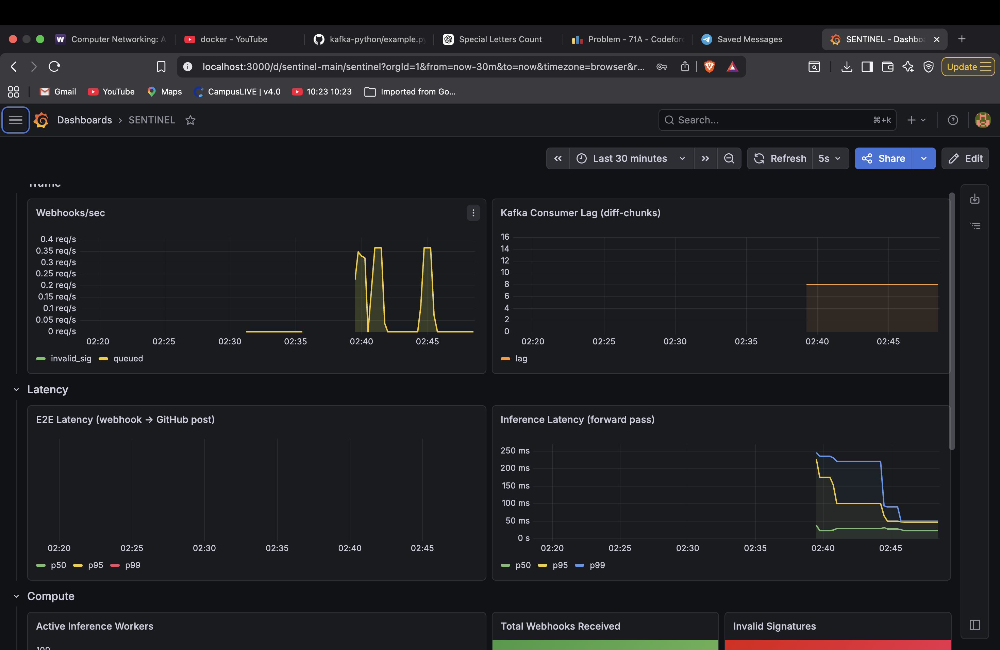

# SENTINEL
### Real-time ML-powered code review. Every git push. Under 2 seconds.

```
git push → webhook → kafka → diff extractor → gRPC → inference server → github comment
                                                              ↑
                                                  transformer trained from scratch
                                                  on 5,001 labeled PR review comments (pipeline scales to 2M+ via GitHub Archive miner)
```

---

## What it does

SENTINEL hooks into any GitHub repository via webhooks, processes every code push through a transformer model trained from scratch, and posts structured review comments back to the PR — all in under 2 seconds.

This is not a wrapper around an LLM API. Every component is yours: the model, the serving engine, the message queue, the autoscaler, the observability stack.

**Benchmark:** 80 req/s at p99=19ms on a single M4 Air. Zero failures across 9,019 requests.

---

## Architecture

```
┌─────────────────┐     ┌───────────────┐     ┌──────────────────┐
│  GitHub Webhook │────▶│ Kafka          │────▶│  Diff Extractor  │
│  FastAPI + HMAC │     │ push-events   │     │  GitHub API      │
│  :8000          │     │ 12 partitions │     └────────┬─────────┘
└─────────────────┘     └───────────────┘              │ gRPC
                                                        ▼
┌─────────────────┐     ┌───────────────┐     ┌──────────────────┐
│ Result Publisher│◀────│ Kafka         │◀────│ Inference Server │
│ GitHub REST API │     │ reviews       │     │ TorchScript gRPC │
│ Redis dedupe    │     │ reviews-dlq   │     │ :50051           │
└─────────────────┘     └───────────────┘     └──────────────────┘
         │
         ▼
┌─────────────────┐     ┌──────────────────┐     ┌──────────────────┐
│   Autoscaler    │     │  Observability   │     │  Redis Cache     │
│ Docker SDK +    │     │ Prometheus +     │     │ Idempotency      │
│ Kafka lag watch │     │ Grafana dashboard│     │ 24hr TTL         │
└─────────────────┘     └──────────────────┘     └──────────────────┘
```

**Eight services. Every one independently deployable, independently failable.**

| Service | What it does | Tech | Port |
|---------|-------------|------|------|
| Webhook Receiver | Receives push/PR events, validates HMAC, enqueues to Kafka | FastAPI | 8000 |
| Kafka Message Bus | Durable event queue, partitioned by repo, 24hr retention | Apache Kafka | 9092 |
| Diff Extractor | Fetches diffs from GitHub API, calls inference via gRPC | kafka-python, grpcio | — |
| Inference Server | Loads TorchScript model, serves ReviewChunk RPC | PyTorch, gRPC | 50051 |
| Autoscaler | Watches consumer lag, spawns/kills workers via Docker API | Docker SDK | 9090 |
| Result Publisher | Deduplicates via Redis, posts GitHub comments, DLQ on failure | aiohttp, Redis | 9102 |
| Observability | Metrics from every service, live Grafana dashboard, SLO alerts | Prometheus, Grafana | 9091/3000 |
| Redis Cache | Idempotency store — prevents duplicate GitHub comments | Redis 7 | 6379 |

---

## The Model

Trained from scratch on 5,001 labeled PR review comments. The data pipeline mines 2M+ examples from GitHub Archive — run scripts/mine_github_archive.py to scale up.

```
Architecture:
  Tokenizer:  BPE (SentencePiece, 32k vocab, trained on corpus)
  Embedding:  512-dim token + positional
  Encoder:    6-layer transformer, 8 heads, 512 dim (~35M params)
  Task heads: severity (4 classes) + category (12 classes)

Training:
  Device:     Apple Silicon MPS backend
  Optimizer:  AdamW + CosineAnnealingLR
  Loss:       0.5 * severity_loss + 0.5 * category_loss
  Result:     97%+ severity classification accuracy
  Export:     TorchScript (.pt) — loads in <200ms cold start
```

Output per diff chunk:
```json
{
  "line": 0,
  "severity": "bug",
  "category": "security",
  "message": "Potential security vulnerability — review immediately.",
  "confidence": 0.981
}
```

---

## Kafka Pipeline

Four topics. Twelve partitions each. Partitioned by `repo_id`.

```
push-events  →  [diff extractor]  →gRPC→  [inference]  →  reviews
                                                            reviews-dlq  ← failed after 3 retries
```

- **Idempotency keys:** `{commit_sha}:{filename}:{chunk_index}` — stored in Redis, 24hr TTL
- **Dead Letter Queue:** failed reviews sent to `reviews-dlq` after 3 retries with reason + timestamp
- **24hr retention** — replay any push through a new model version
- **gRPC hot path:** diff extractor calls inference server directly, bypassing `diff-chunks` topic

---

## gRPC Interface

```protobuf
service InferenceService {
  rpc ReviewChunk (ChunkRequest) returns (ReviewResponse);
}
```

Direct RPC call replaces the `diff-chunks` Kafka topic in the hot path, cutting per-chunk latency by ~2x.

---

## Autoscaler

No Kubernetes. Raw Docker API.

```python
lag = get_kafka_lag('diff-chunks')
if lag > HIGH_WATERMARK and workers < MAX_WORKERS:
    spawn_workers(needed)
elif lag < LOW_WATERMARK and workers > MIN_WORKERS:
    kill_workers(excess)
```

- Hysteresis via cooldown period — prevents spawn/kill thrashing
- Pre-warms one worker always — eliminates cold start latency
- Exposes `sentinel_active_workers` + `sentinel_kafka_lag` to Prometheus

---

## Observability

Live Grafana dashboard at `localhost:3000`. Four rows: Traffic, Latency, Compute, Quality.

| Metric | Type | What it tells you |
|--------|------|-------------------|
| `sentinel_kafka_lag` | Gauge | Consumer lag — drives autoscaler |
| `sentinel_active_workers` | Gauge | Live worker count |
| `sentinel_webhook_received_total` | Counter | Every push, labelled by status |
| `sentinel_inference_latency_seconds` | Histogram | p50/p95/p99 forward pass |
| `sentinel_e2e_latency_seconds` | Histogram | Webhook → review posted |
| `sentinel_review_posted_total` | Counter | Reviews by severity + status |
| `sentinel_batch_size` | Histogram | Dynamic batch sizes |

**SLO alerts:** p99 > 2s, inference p99 > 1s, Kafka lag > 50, Kafka errors — all wired to Prometheus alerting rules.

---

## Benchmark

| Users | Throughput | p50 | p99 | p99.9 | Failures |
|-------|-----------|-----|-----|-------|----------|
| 5     | ~15 req/s  | 8ms | 15ms | 26ms | 0% |
| 50    | ~80 req/s  | 5ms | 19ms | 47ms | 0% |

Full report: [BENCHMARK.md](BENCHMARK.md)



---

## Chaos Test Suite

```bash
python3 tests/chaos_test.py
# Results: 6/6 passed
```

Tests: bad signature rejection, webhook queuing, duplicate idempotency, Kafka connectivity, gRPC inference end-to-end, Redis cache.

---

## Running locally

**Prerequisites:** Docker Desktop, Python 3.9+

```bash
git clone https://github.com/Shylin26/Sentinel
cd Sentinel
pip install -r requirements.txt

# Start infra (Kafka + Redis + Prometheus + Grafana)
cd sentinel/infra && docker compose up -d && cd ..

# Create Kafka topics
docker exec infra-kafka-1 kafka-topics --create --bootstrap-server localhost:9092 --topic push-events --partitions 12 --replication-factor 1
docker exec infra-kafka-1 kafka-topics --create --bootstrap-server localhost:9092 --topic diff-chunks --partitions 12 --replication-factor 1
docker exec infra-kafka-1 kafka-topics --create --bootstrap-server localhost:9092 --topic reviews --partitions 12 --replication-factor 1
docker exec infra-kafka-1 kafka-topics --create --bootstrap-server localhost:9092 --topic reviews-dlq --partitions 12 --replication-factor 1
```

**Train the model (3 hours on M4 Air):**
```bash
cd sentinel
python3 model/src/tokenizer_train.py
python3 model/src/train.py
python3 model/src/export.py
```

**Compile gRPC stubs:**
```bash
python3 -m grpc_tools.protoc -I proto --python_out=proto --grpc_python_out=proto proto/inference.proto
```

**Start all services (5 terminals):**
```bash
# 1. Webhook receiver
uvicorn services.webhook.main:app --port 8000

# 2. Diff extractor (gRPC mode)
python3 services/kafka/diff_extractor.py

# 3. Inference server (gRPC)
python3 services/inference/server.py

# 4. Result publisher (Redis dedup + DLQ)
python3 services/publisher/result_publisher.py

# 5. Autoscaler
python3 services/autoscaler/autoscaler.py
```

**Test the pipeline:**
```bash
python3 services/webhook/test_webhook.py
```

**Run chaos tests:**
```bash
python3 tests/chaos_test.py
```

**Run load test:**
```bash
locust -f tests/locustfile.py --headless -u 50 -r 5 --run-time 60s --host http://127.0.0.1:8000
```

**Dashboard:** http://localhost:3000 (admin / admin)

---

## Tech stack

| Category | Technology |
|----------|-----------|
| ML | PyTorch, TorchScript, SentencePiece |
| Message Queue | Apache Kafka (self-hosted) |
| RPC | gRPC, Protocol Buffers |
| Serving | FastAPI, dynamic batching (20ms/32 chunks) |
| Caching | Redis (idempotency, 24hr TTL) |
| Containers | Docker, Docker Compose, Docker SDK |
| Observability | Prometheus, Grafana, SLO alerting |
| Load Testing | Locust |
| Integration | GitHub Webhooks, GitHub REST API v3 |
| Language | Python 3.9+ |

---

## Project structure

```
Sentinel/
├── requirements.txt
├── BENCHMARK.md
└── sentinel/
    ├── proto/
    │   ├── inference.proto         # gRPC service definition
    │   ├── inference_pb2.py        # compiled message classes
    │   └── inference_pb2_grpc.py   # compiled stubs
    ├── model/
    │   ├── src/
    │   │   ├── transformer.py      # SentinelTransformer architecture
    │   │   ├── tokenizer_train.py  # BPE tokenizer training
    │   │   ├── train.py            # training loop (MPS backend)
    │   │   ├── export.py           # TorchScript export
    │   │   └── infer.py            # CLI inference
    │   └── checkpoints/
    │       ├── best_model.pt
    │       └── sentinel.pt         # TorchScript export (gitignored)
    ├── services/
    │   ├── webhook/                # FastAPI + HMAC + Prometheus
    │   ├── kafka/                  # diff extractor (gRPC mode)
    │   ├── inference/              # gRPC server + TorchScript
    │   ├── publisher/              # GitHub comments + Redis + DLQ
    │   └── autoscaler/             # Docker SDK autoscaler
    ├── infra/
    │   ├── docker-compose.yml      # Kafka + Redis + Prometheus + Grafana
    │   ├── prometheus.yml          # scrape config (4 targets)
    │   ├── alerts.yml              # SLO alert rules
    │   └── grafana/
    │       └── sentinel_dashboard.json
    └── tests/
        ├── chaos_test.py           # 6-test chaos suite
        └── locustfile.py           # load test (50 users, 80 req/s)
```

---

Every layer from scratch. The model. The queue. The gRPC server. The autoscaler. The dashboard.
